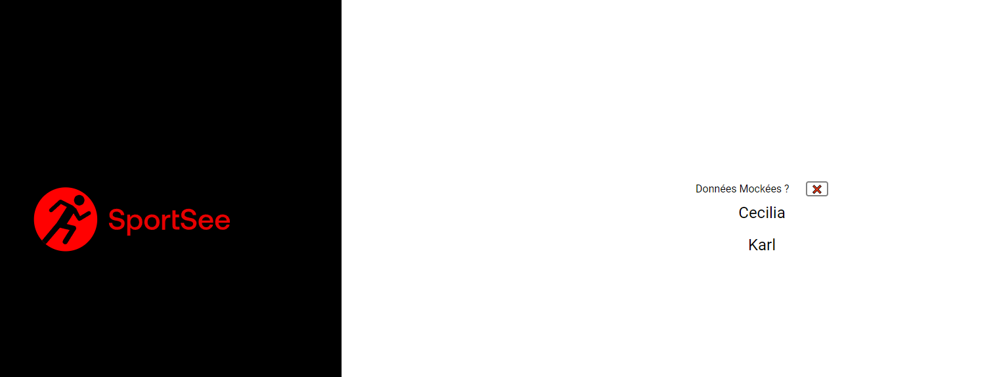

# OPENCLASSROOMS PROJECT 12

Build an athletic user profile page in React, fetching data from a NodeJS server.

## Dependencies

- [React](https://reactjs.org/) v17.0.2

- [recharts](https://recharts.org/en-US) v2.1.6

- [react-router-dom](https://reactrouter.com/web/guides/quick-start) v6.0.2

- [styled-components](https://styled-components.com/) v5.3.3

- [prop-types](https://www.npmjs.com/package/prop-types) v15.7.2

- Recommended text editor: [Visual Studio Code](https://code.visualstudio.com/)

## Installation Dependencies

- You need [Git](https://git-scm.com/) to clone the repository

- You need [Node](https://nodejs.org/en/) (v14.17.1) to run the `npm` commands

- Or You can use [Yarn](https://classic.yarnpkg.com/lang/en/docs/install/#windows-stable) to run `yarn` commands

## Install and run the project

- Clone the project to your computer

`git clone https://github.com/metalfeanor/ChristopheNamoune_12_14112021.git`

- Go to the project folder

`cd ChristopheNamoune_12_14112021`

- Install the packages

`npm i` or `yarn`

- Run the project (port 3000 by default)

`npm start-all` or `yarn start-all`

- To get information about the backend API, go to the link below

[Backend API](https://github.com/OpenClassrooms-Student-Center/P9-front-end-dashboard)

- Once the project is running :

  - You can choose user by clicking on Name button
  - And you can choose Mocked ou Fetched Data

  
